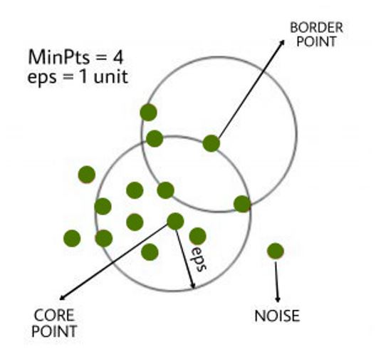

## DBSCAN Clustering

We already have basic clustering algorithms, so why should you spend time and effort learning another one? Clustering is an unsupervised learning technique that groups data points based on specific characteristics. However, algorithms like K-Means and Hierarchical Clustering struggle with clusters of arbitrary shapes and varying densities. This is where DBSCAN (Density-Based Spatial Clustering of Applications with Noise) comes in.

##### Why DBSCAN?

DBSCAN excels at identifying clusters of various shapes and densities while effectively handling noise. Unlike K-Means, which assumes spherical clusters and is sensitive to outliers, DBSCAN groups data points based on density, making it more robust and versatile.

##### Example Scenario

Consider a dataset with points densely arranged in concentric circles. 

 

When we apply K-Means and Hierarchical Clustering to this dataset, they fail to accurately cluster the points and properly detect the noise.

 

In contrast, DBSCAN successfully identifies the three dense clusters and isolates the noise, demonstrating its superior capability in handling complex shapes and densities.

`DBSCAN` groups together data points that are close to each other based on density, rather than trying to create spherical clusters.
The key aspect of DBSCAN is that it can identify and exclude data points that are considered "noise" or outliers - those that do not belong to any dense cluster. This makes DBSCAN well-suited for tasks like outlier detection, as it can identify data points that lie outside the main groups or clusters.
In contrast, K-Means Clustering is very sensitive to outliers. Since it tries to create spherical clusters, the introduction of a single outlier can significantly impact the resulting clusters. DBSCAN, on the other hand, is more robust to outliers and can identify clusters of arbitrary shape, not just spherical ones.
Overall, DBSCAN is a powerful clustering algorithm that excels at handling noisy data and finding clusters of varying densities and shapes, making it a valuable tool in many data analysis and machine learning applications.

### How DBSCAN Works
DBSCAN requires two parameters:
1.	eps (ε): Defines the neighborhood radius around a data point. Points within this radius are considered neighbors. Choosing the right value is crucial; too small, and many points will be marked as noise; too large, and distinct clusters may merge. One way to find the eps value is based on the *k-distance graph*.
2.	MinPts: The minimum number of points required to form a dense region. This value should generally be at least the number of dimensions plus one. The larger the dataset, the larger value of MinPts must be chosen. The minimum value of MinPts must be chosen at least 3.

DBSCAN is highly sensitive to the choice of the epsilon (ε) and minPoints parameters. Selecting appropriate values for these hyperparameters is crucial, as small variations can significantly impact the clustering results produced by the DBSCAN algorithm. The value of epsilon (ε) can be determined using the k-distance graph. This graph plots the distance of each data point to its kth nearest neighbor. The "elbow" or point of maximum curvature in this graph typically indicates the appropriate value of epsilon to use. If the chosen epsilon value is too small, DBSCAN will identify a larger number of clusters, with more data points being classified as noise. Conversely, if epsilon is set too high, smaller clusters will merge into a single large cluster, resulting in a loss of detailed cluster structure.
   
### Key Concepts
DBSCAN classifies points into three categories:

•	Core points: Have at least MinPts neighbors within eps radius.

•	Border points: Have fewer neighbors than MinPts but are within eps of a core point.

•	Noise points: Neither core nor border points.

 
[ref](https://www.geeksforgeeks.org/dbscan-clustering-in-ml-density-based-clustering/)

##### Reachability and Connectivity

Reachability states if a data point can be accessed from another data point directly or indirectly, whereas connectivity states whether two data points belong to the same cluster or not. In terms of reachability and connectivity, two points in DBSCAN can be referred to as:

•	Directly Density-Reachable: Point X is directly density-reachable from point Y if X is within eps of Y and Y is a core point.

•	Density-Reachable: Point X is density-reachable from point Y if there is a chain of points connecting them, where each point in the chain is directly density-reachable from the previous one.

•	Density-Connected: Points X and Y are density-connected if they are both density-reachable from a common point O.

### Steps in DBSCAN Algorithm

1.	Choose eps and MinPts.
   
2.	For each point, calculate its distance to every other point.
   
3.	Identify all neighboring points within the eps radius.

4.	If the point has at least MinPts neighbors, mark it as a core point and create a new cluster if it isn't already part of one.
	
5.	If a point has fewer than MinPts neighbors but is near a core point, mark it as a border point.

6.	Include all density-connected points in the same cluster.
	
7.	Repeat for all unvisited points to identify all core, border, and noise points.

#### Advantages

•	Effectively finds clusters of arbitrary shapes and sizes.

•	No need to specify the number of clusters beforehand.

•	Identifies and handles noisy data.

##### Disadvantages

•	Struggles with clusters of varying densities.

•	Not suitable for high-dimensional datasets.

•	Can fail in datasets with narrow necks or bridge-like structures.

DBSCAN's ability to manage noise and identify clusters of varying shapes makes it an essential tool for complex data analysis. By understanding and utilizing DBSCAN, you can overcome the limitations of traditional clustering methods and unlock more sophisticated insights from your data.

### References

1. https://www.javatpoint.com/k-means-clustering-algorithm-in-machine-learning
2. https://www.geeksforgeeks.org/dbscan-clustering-in-ml-density-based-clustering/
3. https://www.analyticsvidhya.com/blog/2020/09/how-dbscan-clustering-works/
4. Gareth James, Daniela Witten, Trevor Hastie, Robert Tibshirani, (2013). 
An introduction to statistical learning : with applications in R. New York :Springer.

