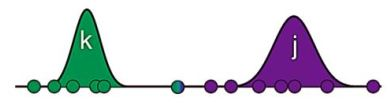

## Gaussian Mixture Models

A Gaussian Mixture Model (GMM) is a probabilistic model that assumes all the data points are generated from a mixture of several Gaussian distributions with unknown parameters. It is widely used in clustering, where the goal is to partition a dataset into subgroups, such that data points in the same group are more similar to each other than to those in other groups. 

#### Why GMM?

While k-means clustering is a popular and straightforward algorithm for clustering, it has several drawbacks:

1. Assumption of Spherical Clusters: K-means: Assumes that clusters are spherical (or roughly spherical) and of similar size. This means it doesn't perform well on clusters with different shapes and sizes.
   
2. Hard Assignments: K-means: Assigns each data point to exactly one cluster (hard clustering), which can be too restrictive and lead to misclassification, especially when data points are near the boundary of clusters.
   
3. Cluster Overlap: K-means: Struggles with overlapping clusters because it assigns each point to the closest centroid, which might not be meaningful if clusters overlap.
   
4. Handling of Outliers: K-means: Can be significantly affected by outliers, as they can distort the mean position of clusters.

    
Gaussian Mixture Models, on the other hand, offer greater flexibility and robustness through probabilistic clustering and the ability to model clusters with different shapes and sizes. GMM can model clusters of different shapes and sizes because each cluster is represented by a Gaussian distribution with its own mean and covariance matrix. Moreover, GMM provides soft assignments, where each data point has a probability of belonging to each cluster. It can naturally handle overlapping clusters by assigning probabilities to cluster memberships, reflecting the uncertainty and overlap between clusters.

#### How GMM Works?
A Gaussian mixture model is simply a model that fits multiple Gaussian distributions to a set of data. Each Gaussian in the mixture model represents a potential cluster. Once our Gaussian mixture fits the data as closely as possible, we can calculate the probability of each case belonging to each cluster and assign the cases to the most likely cluster. The question that arises here is that we know neither the distribution from which each training sample was drawn nor the parameters of the mixture model, however, how can we find a mixture of Gaussians that fits the underlying data well? To do this, we start with initial guesses for the parameters and use them to calculate cluster probabilities for each sample. Then, we use these probabilities to re-estimate the parameters and repeat this cycle until convergence. This is done by employing   expectation- maximization algorithm.

    
*Schematic of the steps of GMM*:

 

1. Gaussian initialization

 

2. Calculating the probability of clusters for each sample

 

3. Updating the means and variances

 

4. Iterating steps 2 and 3 until convergence

#### The math of GMM

**Key Concepts**

1. *Gaussian Distribution*: Also known as the normal distribution, it is characterized by two parameters: the mean $\mu$ and the covariance $\Sigma$. In the univariate case, the probability density function (pdf) of a Gaussian distribution is:
     

In the multivariate case, the pdf is:
    

where $x$ is a $k$-dimensional vector.

2. *Mixture Model*: In a mixture model, each data point is assumed to belong to one of several subpopulations or clusters. The overall distribution of the data is a weighted sum of the Gaussian components.

3. *Latent Variables*: These are hidden variables that represent the cluster memberships of data points. In GMMs, the latent variable $z_{i}$​ indicates the cluster to which the $i$-th data point belongs.

**Model Components**

1. *Parameters*:
  + Means ($\mu_{k}$​): Each Gaussian component has its mean vector.
  + Covariances ($\Sigma_{k}$): Each Gaussian component has its covariance matrix.
  + Mixing Coefficients ($\pi_{k}$): These are the weights of each Gaussian component and must sum to 1. They represent the probability that a randomly selected data point comes from the $k$-th component.

2. *Probability Density Function*: The overall pdf of the mixture model for a data point $x$ is given by:
    

where $K$ is the number of Gaussian components.

Estimation

The parameters of a GMM are typically estimated using the Expectation-Maximization (EM) algorithm, which iteratively refines the parameters to maximize the likelihood of the observed data.

    Initialization: Start with initial guesses for the parameters μkμk​, ΣkΣk​, and πkπk​.

    Expectation Step (E-Step): Calculate the posterior probabilities (responsibilities) that each data point belongs to each Gaussian component:
    γik=πkN(xi∣μk,Σk)∑j=1KπjN(xi∣μj,Σj)
    γik​=∑j=1K​πj​N(xi​∣μj​,Σj​)πk​N(xi​∣μk​,Σk​)​

    where γikγik​ is the responsibility of component kk for data point ii.

    Maximization Step (M-Step): Update the parameters using the responsibilities:
    πk=1N∑i=1Nγik
    πk​=N1​i=1∑N​γik​
    μk=∑i=1Nγikxi∑i=1Nγik
    μk​=∑i=1N​γik​∑i=1N​γik​xi​​
    Σk=∑i=1Nγik(xi−μk)(xi−μk)T∑i=1Nγik
    Σk​=∑i=1N​γik​∑i=1N​γik​(xi​−μk​)(xi​−μk​)T​

    Repeat the E-Step and M-Step until convergence.
#### Advantages

•	Flexibility: GMM can model clusters of different shapes and sizes because each cluster is represented by its own Gaussian distribution with its own mean and covariance.

•	Soft Clustering: Provides probabilistic cluster memberships, which can be more informative than hard assignments.

#### Limitations:

•	Computational Complexity: EM algorithm can be computationally intensive, especially for large datasets or high-dimensional data.
•	Local Optima: EM algorithm can converge to local optima, depending on the initialization. Multiple runs with different initializations are often used to mitigate this.
•	Assumption of Gaussian Distribution: The model assumes that the data within each cluster follow a Gaussian distribution, which may not always be true.

#### Applications

•	Image and Speech Recognition: GMMs are used to model the distribution of features in image and speech data.
•	Anomaly Detection: By modeling normal data with GMMs, anomalies can be detected as data points with low likelihood under the model.
•	Finance: Used for modeling and forecasting financial data distributions.

### References

1. https://www.javatpoint.com/k-means-clustering-algorithm-in-machine-learning
2. https://www.geeksforgeeks.org/dbscan-clustering-in-ml-density-based-clustering/
3. https://www.analyticsvidhya.com/blog/2020/09/how-dbscan-clustering-works/
4. Vazan Milad, (2022), Machine learning and data science: ّFoundations, concepts, algorithms and tools. 

