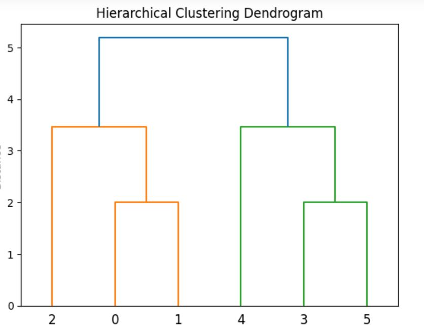
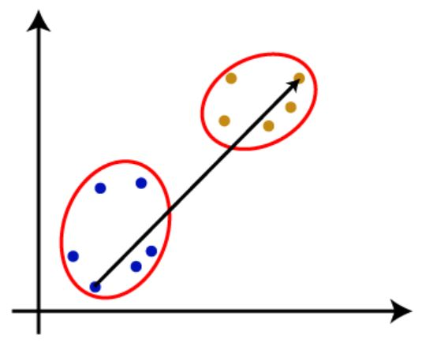
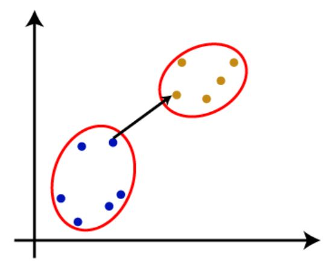
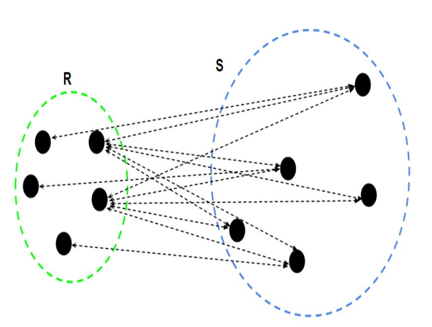
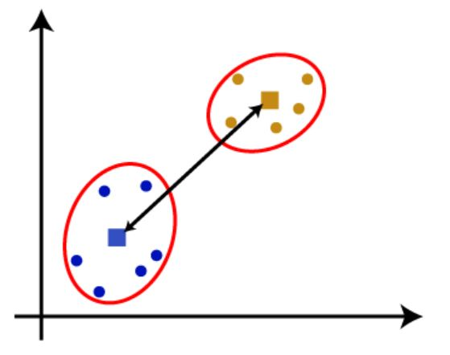
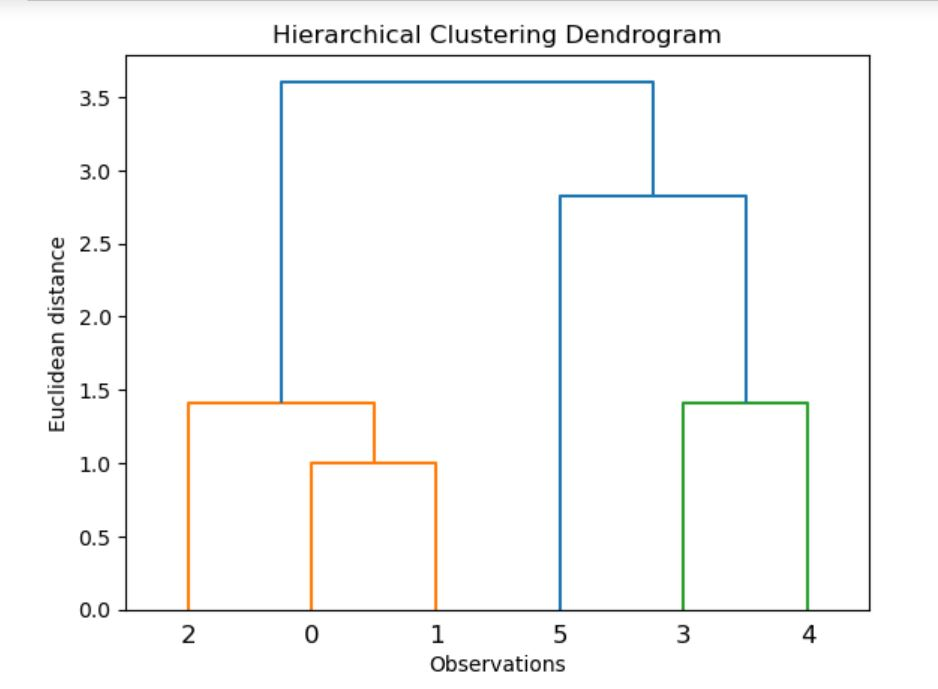
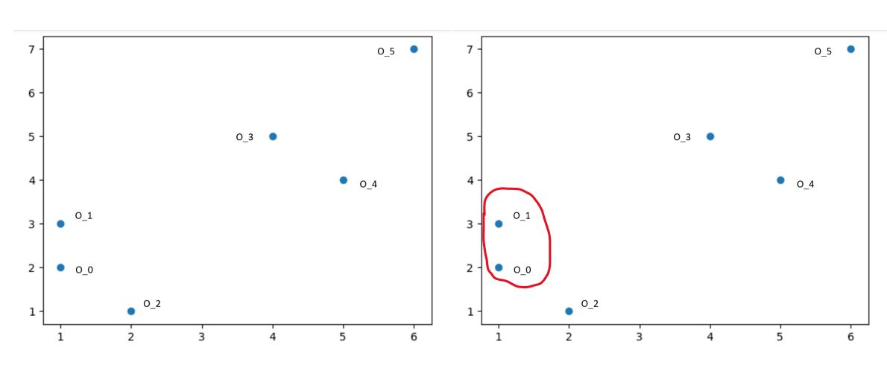
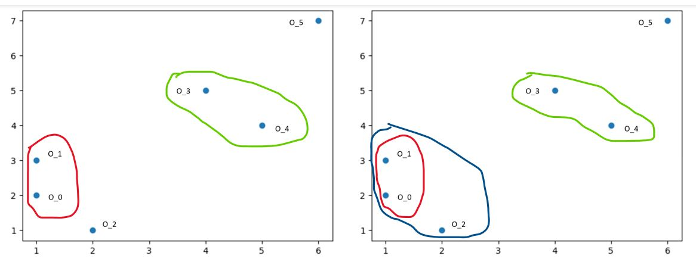
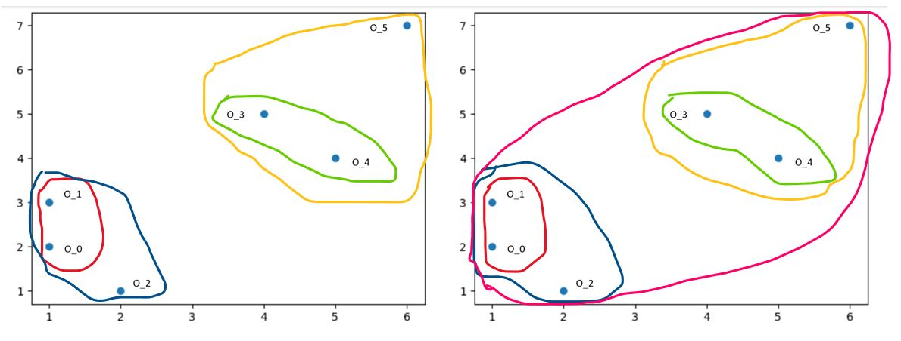

### Hierarchical Clustering

Hierarchical clustering develops the hierarchy of clusters in the form of a tree. This tree-shaped structure is known as *dendrogram*. In fact, dendrogram is a tree diagram that is used to show the arrangement of clusters produced by hierarchical clustering. Instead of receiving a "smooth" output of clusters, hierarchical clustering gives us a tree of clusters. 

 

When trying to learn a hierarchy from data, there are two approaches:

+ Agglomerative: It is a bottom-up approach in which the algorithm is performed by taking all data points as individual clusters and merging them until one cluster remains.

+ Divisive: This approach is the opposite of the agglomerative approach and is top-down. That is, it starts with all items in a cluster and recursively divides them into clusters until each item is in its own cluster.

#### How the Agglomerative Hierarchical clustering Work?

The hierarchical clustering dendrogram is constructed through a straightforward algorithm. First, we define a measure of dissimilarity between each pair of observations, often using Euclidean distance. The algorithm then proceeds iteratively:

Step 1: Initially, each of the n observations is treated as its own cluster.
 
Step 2: The two clusters that are most similar to each other are then merged, resulting in n-1 clusters.
 
Step 3: Step 2 is repeated, merging the two most similar clusters at each step, until all observations belong to a single cluster, completing the dendrogram.

#### Measure for the distance between two clusters

The key challenge is how to define the dissimilarity between two clusters, when one or both contain multiple observations. This is addressed by the concept of linkage, which specifies how to extend the pairwise dissimilarity measure to groups of observations. The four most common types of linkage are:

1. *Complete linkage*: The dissimilarity between two clusters is the maximum of all pairwise dissimilarities between observations in the two clusters.

 
   
2. *Single linkage*: The dissimilarity between two clusters is the minimum of all pairwise dissimilarities between observations in the two clusters. This can lead to elongated, "chaining" clusters.

  
 
3. *Average linkage*: The dissimilarity between two clusters is the average of all pairwise dissimilarities between observations in the two clusters.

 

4. *Centroid linkage*: The dissimilarity between two clusters is the dissimilarity between their centroids (the mean vectors of the observations in each cluster). This can sometimes result in undesirable inversions in the dendrogram.

 

### Woking of Dendrogram in Hierarchical clustering

Presented in the below figure, six observations $O_{0},…,O_{5}$ are clustered by using Single linkage and Euclidean distance. 

 

Illustration of the steps of the agglomerative hierarchical clustering algorithm with Single linkage and Euclidean distance is shown as follows: 

 

Left: Each of the points $O_{0},…,O_{5}$ is considered as a separate cluster. Right: The datapoints $O_{0}$ and $O_{1}$ combine together and form a cluster, correspondingly a dendrogram is created, which connects $O_{0}$ and $O_{1}$ with a rectangular shape. The hight is decided according to the Euclidean distance between the data points.

 

Left: The two clusters  $O_{3}$ and $O_{4}$  form a cluster, and the corresponding dendrogram is created. It is higher than of previous, as the Euclidean distance between $O_{3}$ and $O_{4}$ is a little bit greater than the $O_{0}$ and $O_{1}$. Right: New dendrograms are created that combine $O_{0}$, $O_{1}$ and $O_{2}$ in one dendrogram. 

 

Left: New dendrograms are created that combine $O_{3}$, $O_{4}$ and $O_{5}$  in one dendrogram. Right: At last, the final dendrogram is created that combines all the data points together.
